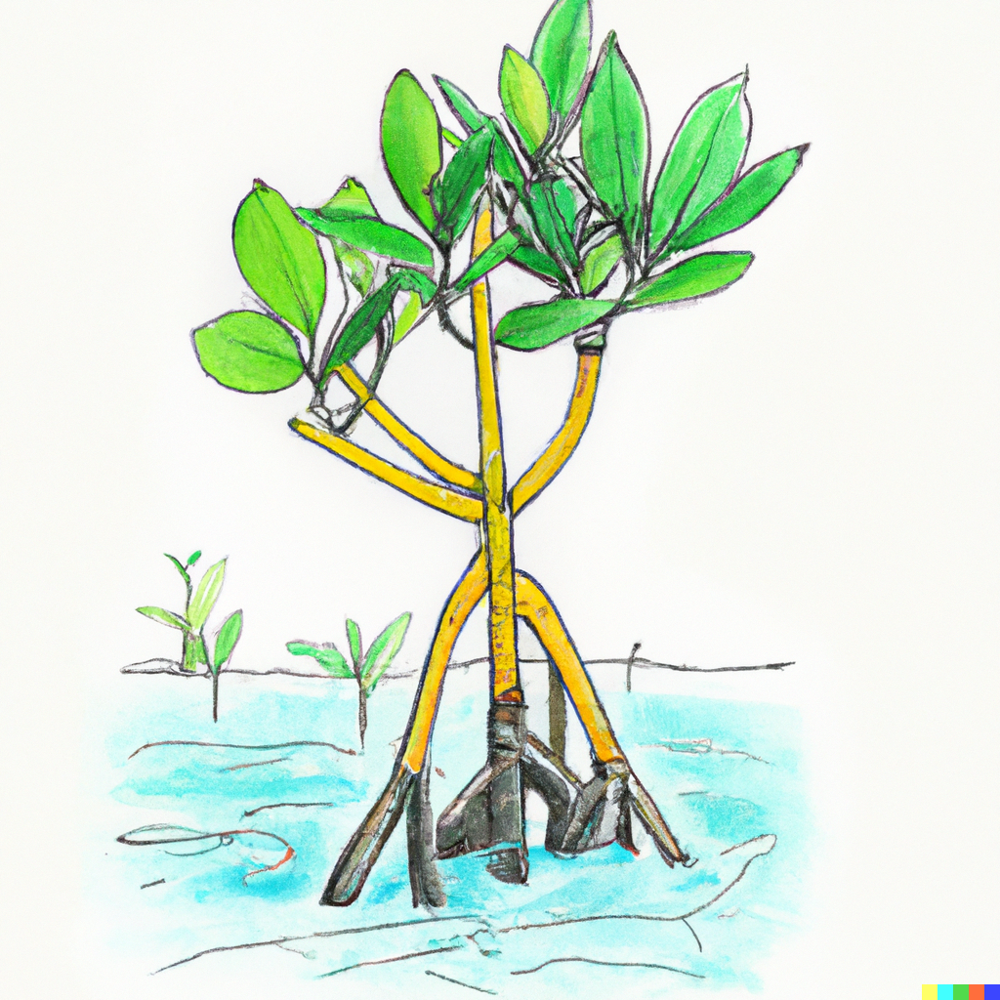
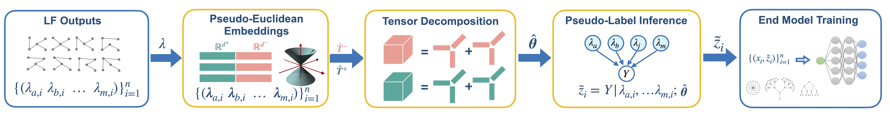

# Mangrove
<div>
  
</div>

# Aggregating Foundation Model Objects with Weak Supervision
Mangrove is our method for aggregating multiple noisy objects to recover the groundtruth. It is based on tensor decompositions and psuedo-Euclidean embeddings.
Building upon these two powerful tools Mangrove provides a highly effective solution for weak supervision beyond binary classification use cases e.g. high cardinality label spaces or structured label spaces such as chains, trees, and other intermediate structures used in techniques like chain-of-thought (CoT) prompting and other reasoning approaches.

This repository contains code for the method and experiments presented in our [blog post](https://sprocketlab.github.io/posts/2023/06/lifting-ws/). 

<div>
  
</div>

Check out our [blog post](https://sprocketlab.github.io/posts/2023/06/lifting-ws/) and paper on
[arXiv](https://arxiv.org/abs/2211.13375)
for more details!

## Running Experiments
First install the dependencies by following these steps,
* ### Installing Dependencies
  We recommend using `conda` to install the dependencies:

  To install the dependencies:
  ```
  git clone https://github.com/SprocketLab/Mangrove.git

  cd Mangrove

  conda env create -f environment.yml
  conda activate mangrove
  ```
  This will install all dependencies except flyingsquid, to install it run the following command
  
  ```
   pip install flyingsquid
  ```

* ### Experiments
  * To see the effectiveness of the pseudo-Euclidean embeddings see the notebook  `expirments/pse-examples/PSE-Examples.ipynb`.
  * For experiments on complete graph metric i.e. 0-1 loss in multi-class classification see the python script `experiments/Tensor-LM-CG/run_complete_graph.py` and then visualize the results using the notebook `experiments/Tensor-LM-CG/visualize_results_cg.ipynb`.

  * For experiments on a tree metric see the python script `experiments/Tensor-LM-Tree/run_tree_metric.py` and then visualize the results using the notebook `experiments/Tensor-LM-CG/visualize_results_tree.ipynb`.

  * The experimental details and results for aggregating chain of thoughts for game of 24 are in the notebook `experiments/game_of_24/game_of_24_main.ipynb`.


## Citation

If you use our work or found it useful, please cite our [paper](https://proceedings.neurips.cc/paper_files/paper/2022/file/f463d31ed2fdd7b0ec585c041ec1baa8-Supplemental-Conference.pdf) at NeurIPS 2022:
```
@inproceedings{vishwakarma2022lifting,
  author = {Vishwakarma, Harit and  Sala, Frederic},
  title = {Lifting Weak Supervision To Structured Prediction},
  booktitle = {Advances in Neural Information Processing Systems},
  year = {2022},
  volume={35}
}
```
